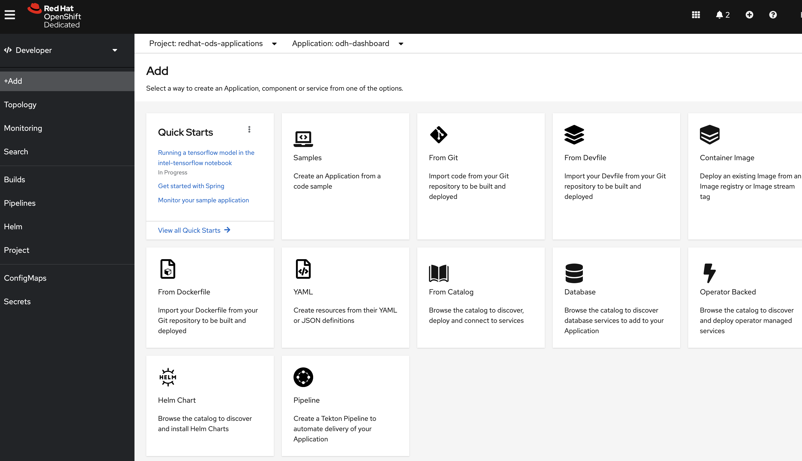

## ODH-Dashboard Design Improvements

### Overview of Current Design

Dashboard Cards are tiled within the dashboard and have several flavors:

- components (ODHApp)
- documentation, how-to, tutorial (ODHDoc)
- getting-started (ODHGettingStarted)
- quickstarts (QuickStart)

These cards are shown below in the odh-dashboard UI:




The cards are fetched from a local [data directory](https://github.com/red-hat-data-services/odh-dashboard/tree/master/data) when odh-dashboard initializes. 
The data directory tree is shown below:

```
data
├── applications
│   ├── anaconda-ce.yaml
│   ├── jupyterhub.yaml
│   ├── ...
│   └── watson-studio.yaml
├── docs
│   ├── anaconda-tutorial.yaml
│   ├── auto-ai-experiment-model-tutorial.yaml
│   ├── ...
│   └── watson-studio-setup-openscale-how-to.yaml
├── getting-started
│   ├── anaconda-ce.md
│   ├── jupyterhub.md
│   ├── ...
│   └── watson-studio.md
└── quickstarts
    ├── anaconda-ce-create-jupyter-notebook-quickstart.yaml
    ├── connect-rhosak-notebook-quickstart.yaml
    ├── ...
    └── seldon-deploy-outlier-quickstart.yaml
```

The odh-dashboard will add application cards to its UI only if the card type (ODHApp) attribute "kfdefApplications" references a KfDef component installed by the ODH Operator.
Additionally, enabled applications only appear when the ODHApp.isEnabled attribute is true. This attribute is set to true if and only if the Marketplace Operator has registered a 
Cluster Service Version (CSV) with the Operator LifeCycle Manager. Only then will its cards be enabled and exposed within the UI.


### Existing Limitations

Currently dashboard cards are either associated with KfDef Components in the base ODH Platform or MarketPlace operators installed on top of the ODH Platform.
Having cards bundled separately from the KfDef component or MarketPlace Operator complicates their installs and has a number of limitations and disadvantages:

1. These KfDef components or MarketPlace Operators need to update the odh-dashboard data directory separately in order to add, delete or modify their related cards.
   Note that the data directory is baked into the odh-dashboard container and is not a volume mount. 

2. Many KfDef components include overlays that enable particular features or deploy specific resources to the cluster. These overlays may not match what is 
   shown within the odh-dashboard since their is no filtering mechanism within the odh-dashboard related to overlays.

3. Many Marketplace Operators exist within their own version lifecycle or exist in multiple versions. These must be coordinated with the odh-dashboard version lifecycle.
 
4. KfDef component or MarketPlace Operator updates must make due with existing cards within the odh-dashboard until the next odh-dashboard release.

5. Reuse of the odh-dashboard is limited given that the category of cards is fixed, static and embedded in the container.

6. Schema changes and improvements for ODHApp and ODHDoc are difficult and error-prone since the frontend and backend types must be manually synced and all data instances updated.

7. Adding new cards and card capabilities desired by KfDef component owners or MarketPlace Operators are cumbersome and difficult since it requires coordination with the odh-dashboard 
   team or knowledge of the odh-dashboard. All changes must be routed through odh-dashboard pull requests.


## Summary of Changes

- Create kubernetes CustomResourceDefinitions for the ODHApp, ODHDoc types. Call these CRD's ConsoleApplication and ConsoleDocument respectively in order to match the existing ConsoleQuickStart CRD.
- Change `ResourceWatcher<ConsoleApplication>` and `ResourceWatcher<ConsoleDocument>` callback hooks to fetch and watch their respective CustomResources from the odh-dashboard namespace rather than read from the data directory.
- Create a typescript type generator to generate their types ConsoleApplication and ConsoleDocument for the frontend and backend using their CustomResourceDefinition openAPIV3Schemas.✝
- Use kubebuilder to create the CustomResourceDefinitions for ConsoleApplication, ConsoleDocument kubernetes resources.✝
- Move existing data definitions to their respective KfDef components within odh-manifests or within the operator that installs complementray resources such as ImageStreams, Deployments, Services, Routes, etc. These ConsoleApplication or ConsoleDocuments can be part of the operator's helm chart or an overlays within a KfDef Component.


✝: Currently is this under a separate github repo [odh-console-types](https://github.com/kkasravi/odh-console-types) and will be added to this repo in a subsequent PR.
